# 
 Git, (Mini)conda, Python Jupyter Notebook

## Table of Contents
1. [Getting Started with Git/GitHub](#git)
2. [Conda](#conda)
    * [Installing Miniconda for Windows](#windows)
    * [Installing Miniconda for Mac](#mac)
3. [What is a Notebook?](#notebook)
4. [Getting Started with Notebooks](#start)
    * [Google Colaboratory (recommended)](#colab)
    * [Jupyter Notebook](#jupyter)
    * [VS Code](#vscode)
    * [Interactive Notebook (VS Code)](#interactive)

## Getting Started with Git/Github 

### What is Git/GitHub? 

*Git* is a version control system: it is essentially a tool that keeps track of file history. A **repository**, or a repo, is a place where files and their histories are stored.

*Github* is a Git cloud service where you can access repositories.

### Why use Git?

Git helps developers collaborate on code. It keeps a record of all the changes made so we can go back in history if there is faulty code. Each person can work on the code in their own separate *branch*, then commit any changes they make.

### Install Git

To check whether you have Git installed, open a Terminal window and type `git --version`. If it is installed, you should have at least version 2.x. If it is not installed, go to the [downloads page](https://git-scm.com/downloads) to install it.

### Forking a Repository

Forking a repository copies the source code to a new repository, where you can make your own separate changes. To fork, go to the repository [website](https://github.com/tritonhacks/Tritonhack2024-ML-Starter-Kit) and click "Fork" on the top right. 

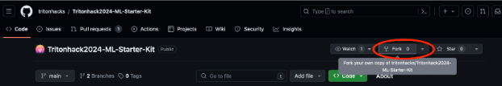

Then, click "Create Fork".

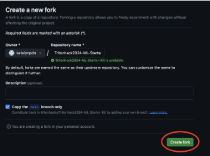

### Cloning a Repository

Now that you have a fork of the repository, you can now save the code to your local computer by cloning it. 
1. To clone a repository, first go to your forked repository and copy the URL address. It should look something like: `https://github.com/MY_USERNAME/Tritonhack2024-ML-Starter-Kit`
2. Open a Terminal window and type `git clone `, then copy and paste your URL. Hit enter.
3. Success! It should say, `Cloning into…` and `Unpacking into…`

### Additional Information

#### Files: .gitignore

Sometimes we want to tell Git to ignore certain files in our project. For example, we may have temporary or log files that we don’t want to commit every time. In this case, our repository has a `.gitignore` file that will list what files to ignore. 

For example, having `*.log` in `.gitignore` will tell Git to ignore any files ending in `.log`. Adding `temp/` will tell Git to ignore all files in the `temp` folder. 

## Conda 

### What is Conda?

Conda is a package management system that keeps packages (NumPy, pandas, etc.) compatible with your projects. It is incredibly useful for people working in data science and machine learning because it allows them to use different versions of the same package across different projects. 

The software you will download, Miniconda, will include Conda, Python, and some functional packages.

### Installing Miniconda for Windows 

First, go to this [link](https://conda.io/projects/conda/en/latest/user-guide/install/windows.html). Once you’re there, click on “Miniconda Installer for Windows” as shown below:

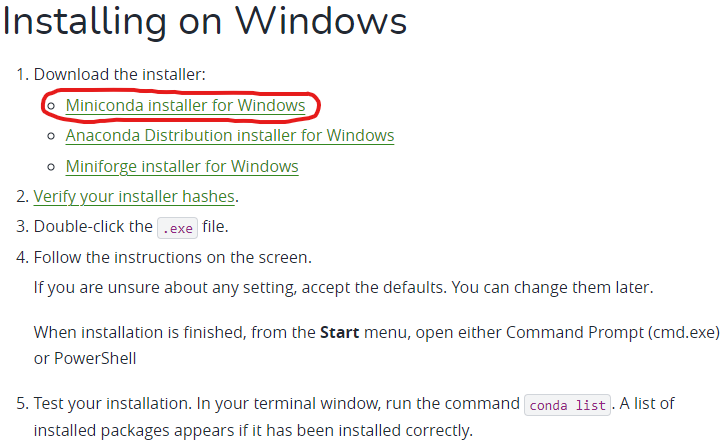

This should take you to a link with instructions to install Miniconda. Scroll down to the very bottom until you see this:

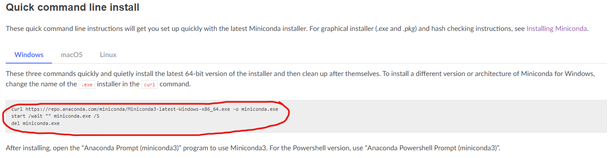

Copy the text circled in red using Ctrl+C. Next, press the Windows key and search for “Command Prompt”. Open it up, and paste the text into the terminal. It should look like this:

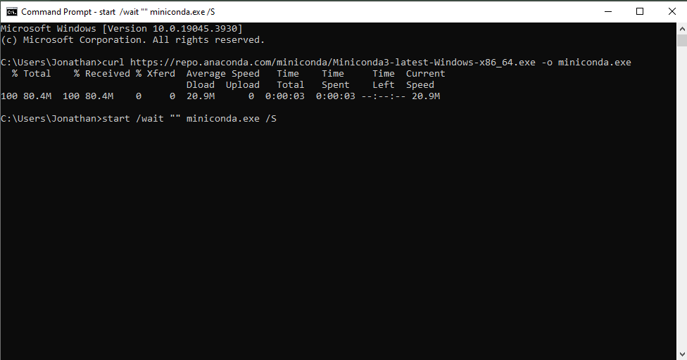

Wait until a line pops up right below the last line that, after the name of your current working directory, reads: `del miniconda.exe`. Press Enter, then close the Command Prompt. Next, press the Windows key and search for “Anaconda Prompt”. Once you have found it, open it. It should look like this:

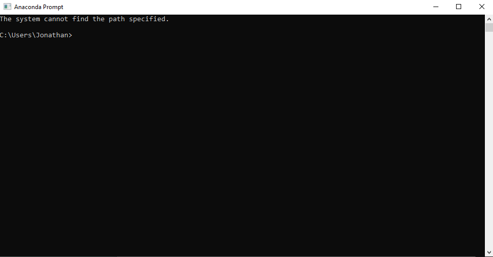

If you’ve made it this far, congratulations! You have finished setting up Miniconda on your WIndows device. Although there doesn’t look like much going on here, you can type “help”, then press Enter to discover a list of commands for Conda. 

### Installing Miniconda for Mac 

1. First, go to the Miniconda website at this [link](https://docs.conda.io/projects/miniconda/en/latest/miniconda-install.html). 
2. Next, click on “**macOS graphical installer**”
3. Click “**Download the installer,**” circled below.

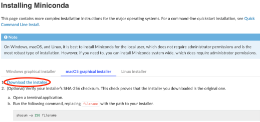

4. Under “**Latest Miniconda installer links,**” click on one of the two .pkg files, depending on whether you have a M1/M2 Mac or Intel Mac (If you don’t know, click the Apple logo on the top left and click “About This Mac”).

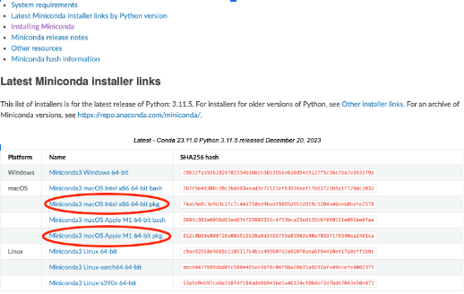

5. Once the .pkg file is done downloading, double click on the file in your Downloads folder.
6. Answer the prompts on the screen to let the installer download Miniconda.
7. Success! After it is done installing, it should say “Thank you for installing Miniconda.”
8. Open a new Terminal window and run `conda list`. If you successfully installed Miniconda, a list of packages should appear. You’re all done!

## What is a Notebook? 

A notebook is an interactive computational environment in which users can execute a particular piece of code and observe the output and make changes to the code to drive it to the desired output or explore more. Jupyter notebooks are heavily used for data exploration purposes as it involves a lot of reiterations. It is also used in other data science workflows such as machine learning experimentations and modeling. Data Science requires several trials and failure to find the “sweet spot” for the model and rerunning the entire program will be time-consuming and tiring. Using a notebook, data scientists can reduce their time and cost efficiently. It can also be used for documenting code samples. A Jupyter notebook has independent executable code cells that users can run in any order.

In this project, you will be introduced to Python Jupyter Notebook. It is totally up to you guys to use either Jupyter Server or just the given IDE such as Visual Studio Code.

Jupyter notebook is one of the most common forms of notebooks out there. The notebook usually has a domain (or extension) of `.ipynb`. There will be a starter notebook file in the project as well. First, there are 2 different ways you can run your code on the notebook. First is to use the given IDE (for instance, Visual Studio Code). If you guys have successfully installed Conda and the given environment, you guys should be able to run any notebook. Before we run anything, we want to set the environment for the notebook.

## Getting Started with Notebooks 

There are many ways to getting started with Jupyter Notebooks. Using Google Colaboratory (Google Colab) is recommended due to its simplicity and time-efficiency, but feel free to choose whichever setup is most comfortable for you. 

### Google Colaboratory (recommended) 

First, go to the Google Colab [site](https://colab.research.google.com/). Once you are there, click on the blue “Sign In’ button at the top right corner of the page.

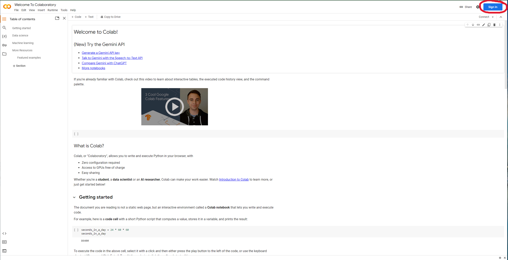

Sign in with your Gmail address. Once signed in, you may get a pop-up that says “Open Notebook” as the title. If not, or if you may have accidentally misclicked somewhere outside the pop-up, fret not! Click on “File” by the top left corner, then click on “Open Notebook” from the dropdown:

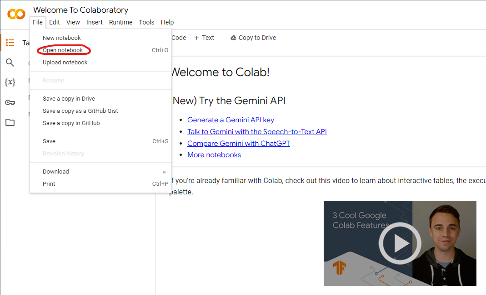

You should get the pop-up as shown below. Once you’re there, click on “GitHub” from the list on the left:

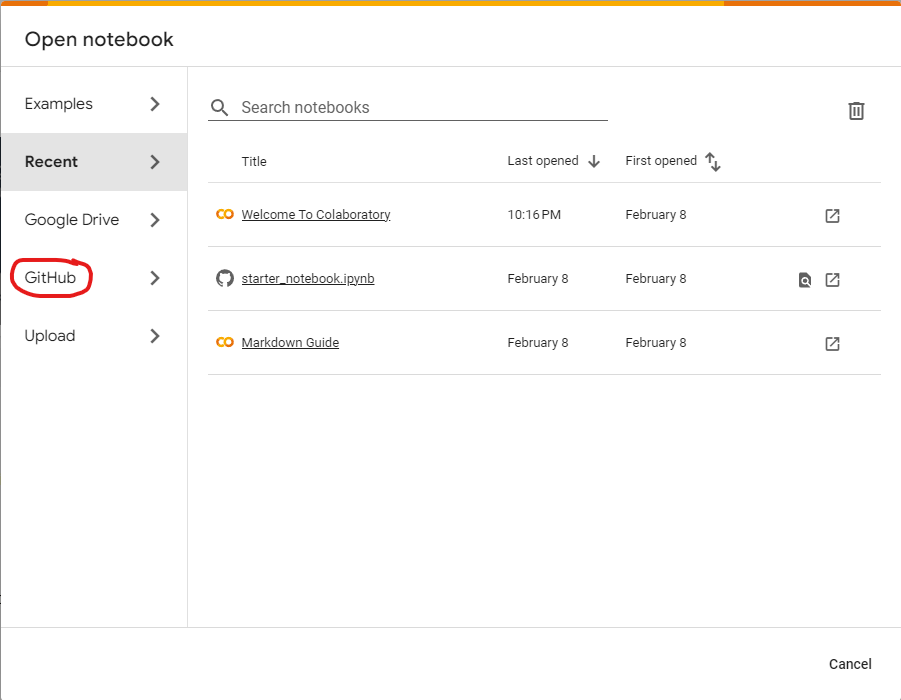

You might get a pop-up window that asks you whether you want GitHub to have access to your Google account. Whether you’d like to allow access or not is up to you (it may be useful to allow access now if you plan on working on data science/machine learning projects through Google Colab in 
the future). Next, copy and paste this link into the search bar where it asks to enter a GitHub URL: https://github.com/tritonhacks/Tritonhack2024-ML-Starter-Kit/tree/main

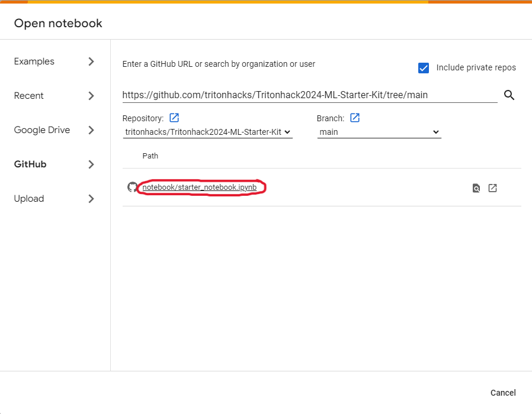

The screenshot above only displays the file for the starter notebook. This is because the screenshot was taken at the time the starter kit was being developed–there may currently be other files. By copying and pasting a valid GitHub URL for a repository, Google Colab will look for files 
within the repository that are Jupyter Notebooks (files ending with the extension `.ipynb`). For now, open the starter notebook by clicking on the file circled in red. You should now see this:

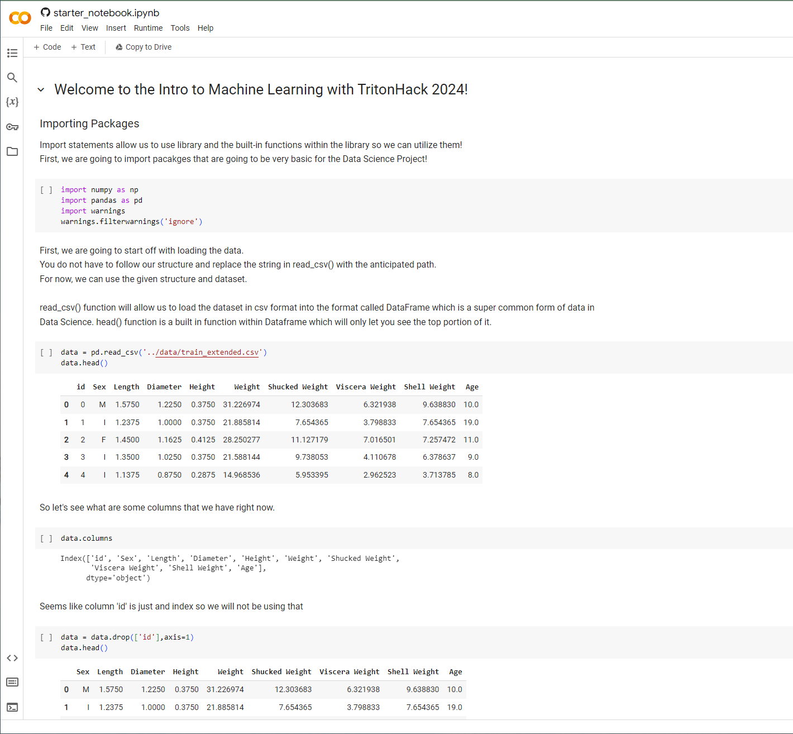

Once you’re here, you’re ready to start making some edits to your Jupyter Notebook file!

### Jupyter Notebook 

On your terminal, while the Conda environment is activated, use the command `jupyter notebook`: 

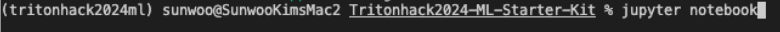

You will be able to see the messages like this and your default browser will be opened automatically and guide you to the Jupyter Server. 

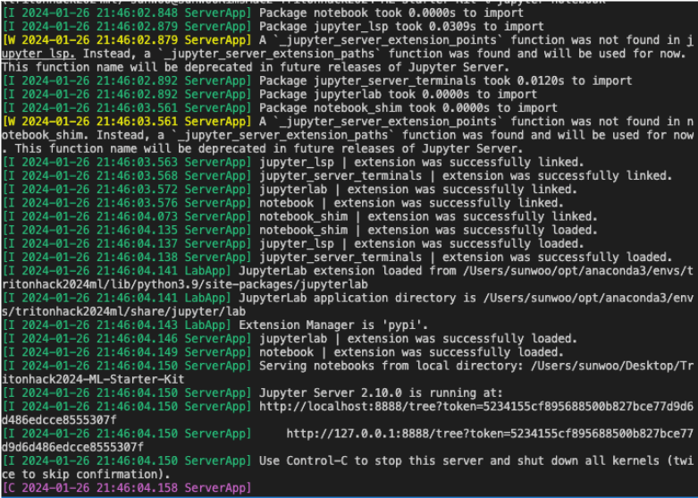

In the server, click on the notebook file that you want to open. 

Now, you can select the cell that you want to learn, and then press the run button!

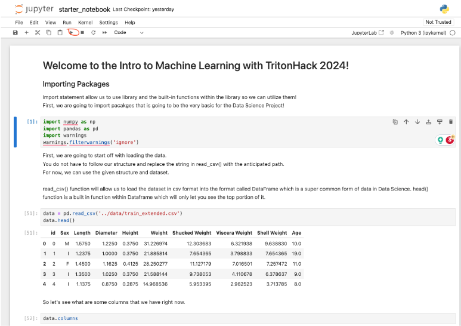

### VS Code 

First, open the file. You will be able to see the notebook’s environment at the top right corner. Click on that. 

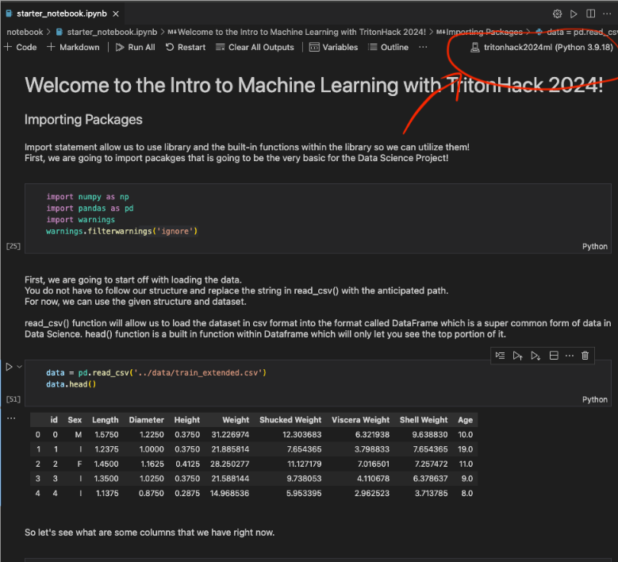

After that, you should be able to see the search bar and the dropdown menu like the image below. Click on `Select Another Kernel`. 

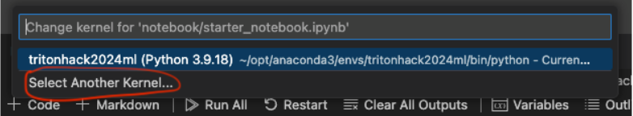

Then, click on Python Environments.

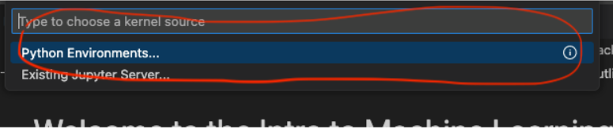

Then, you should be able to see the list of environments, including the environment that you created earlier! Select the environment that you want to use (in this case, you would want to select `tritonhack2024ml`).

Now you are all set! You can run each cell individually now by clicking the run button. 

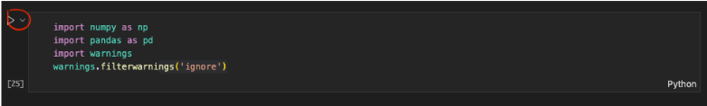

### Interactive Notebook (VS Code) 

In some cases, you do not want to use Jupyter Notebook, but the Python file instead because you want to embed the code into your program. It can be very annoying to convert all these notebook codes to the actual file. In this case, you can use Python File directly. 

By typing `#%%`, you will automatically generate a Jupyter-like cell within the code. Press `Run Cell` here.

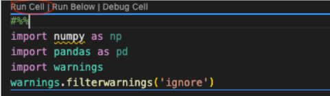

Then it will open an interactive window here, but there is an error. Why? It is because we are not using the environment that we created (even if you did not get an error, please switch it to the environment that you created using yml file)cd . To solve this, click on the environment at the top right corner.

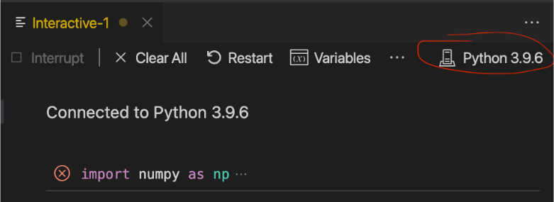

Then, click on Python Environments.

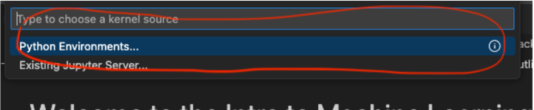

Then, you should be able to see the list of environments, including the environment that you created earlier! Select the environment that you want to use (in this case, you would want to select `tritonhack2024ml`).

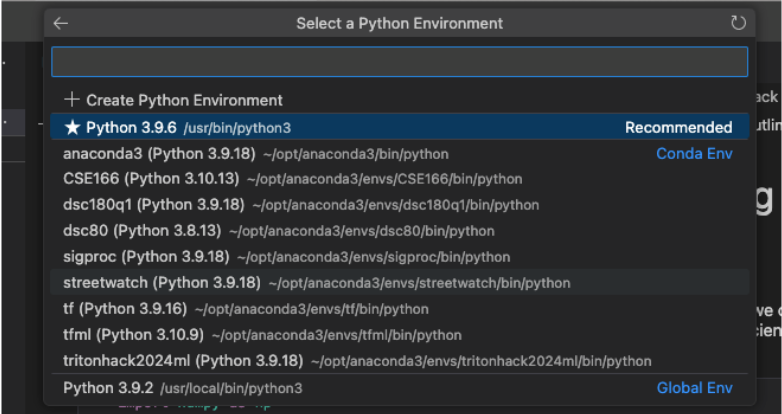

Now you are all set!